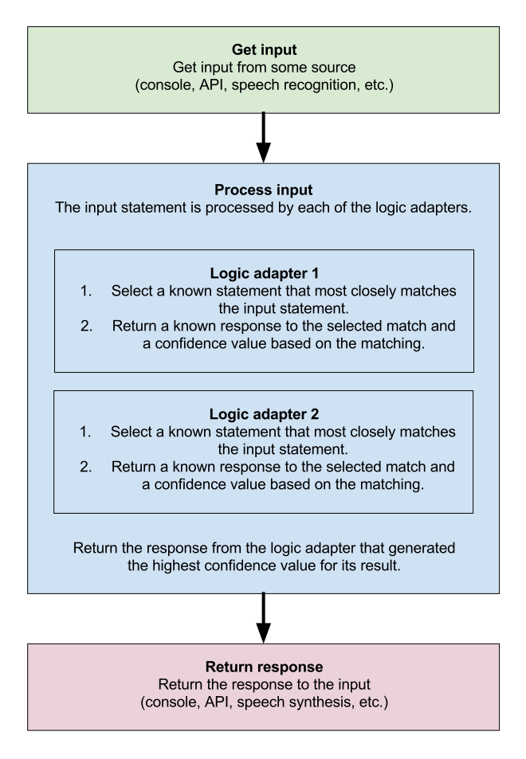

# Chatbot-project
This repository contains the implementation of the chatbot project by ALPHA Team under a competition conducted by Programming Club IIT Mandi. The flowchart below will give you a brief insight and layout of the project.

# Key Features 
* Intent Classifier        
* Voice input
* Emoji output on chit chat
* Answers a variety of college queries like clubs,hostels,academics,placement stats,food and campus.
* Answers basic programming queries for freshers and can do chit chat conversation.

# Intent Recogniser
The main concept used here is **TF-IDF Vectorization**. It means Term frequency and Inverse Document Frequency Vectorization. First of all it builds a vocabulary from the training data. As a final result we have to get vocabulary vector for each sentence which gives weight of each word of vocabulary in a sentence For calculating the formula is:
                    `Tf-Idf= Tf * Idf ; where Idf= log(|D|/1+{d:t in d}) `
The term frequency(tf) if the frequency of a term in a sentence and the Inverse document frequency is the logarithmic ratio of total documents (sentences) to the number of sentence in which the term (t) is present. IDF factor ensures to give more weitage to unique words in a sentence rather than the words which are frequent in other sentences. This way it penalizes the most frequent or common words to give them less weights. 
Now We use binary weighted Logistic regression on Tfidf transformed vectors 2 times to classify into 3 categories ['dialogue','stackoverflow','college_query']. We use `"class_weights=balanced" as a parameter in logistic regression` because the number of examples in college queries are small as compared to dialogue and programming queries. After this we achieve a good accuracy(90%) on both the binary classifiers thus achieving 81% overall accuracy.
Now we are prepared to take an input and classify into the required three categories.
# Retrieval based model using Word2vec
The first step of every model involves Text preprocessing. The main concept used in Retrieval based model is **Word2Vec**. Word2Vec involves transforming each word into a 100-300 dimensional feature vector.The architecture of Word2vec model comprised of a CBOW Continuous Bag of Words model which predicts the current word from a window of surrounding words. It uses negative sampling method that minimizes the log-likelihood of the sampled negative sentences in training. It is obvious that such a model will require a large corpus to train. So For training ,i have used `Google news pretrained word vectors` and intersected its vocabulary with my own model on queries dataset. So that most of the words in my model will have decent vectors and then i have further trained the model on some epochs to update the vectors after vocabulary intersection. Now the words in the model will have their vector representations and **similar words will have similar vector representations**. So when user will enter a question the word vectors which are in the vocabulary(we had another option for words not in vocabulary we could have checked that word from google news vectors but it is a large file to be used while running a model) will be averaged in the sentence to get a single vector representation of that sentence. And the questions in the dataset are also averages over words in a sentence to get a single mean vector for that sentence. Now we will match cosine similarity of the   question vector with all question in the specific dataset (with programming questions for programming query and college question for college query). If the highest similarity is greater than a threshold then we will return the answer other wise a specific message is given as output for that specific type(already detected by intent classifier) of query.
# Stackoverflow bot
Programming queries are first by-passes through a retrieval based bot trained on freshers queries and if threshold is low, it goes to the stackoverflow bot built on a larger dataset and it is a pre trained model(got from Coursera NLP course) which uses word embeddings and matches cosine similarity of question and also uses tag classifier to identify the tag of query. This method is also similar to that explained above.

# Chatterbot 
ChatterBot is a Python library designed to make it easy to create software that can engage in conversation.

An untrained instance of ChatterBot starts off with no knowledge of how to communicate. Each time a user enters a statement, the library saves the text that they entered and the text that the statement was in response to. As ChatterBot receives more input the number of responses that it can reply and the accuracy of each response in relation to the input statement increase.

The program selects the closest matching response by searching for the closest matching known statement that matches the input, it then chooses a response from the selection of known responses to that statement.

# Input
Here input can be text or audio. For text, it gets processed and passed through the model to give an appropriate answer according to the question. If the input is audio, it gets uploaded to ibm's cloud and uses ibm's watson speech to text model, and processed as text further.
The IBM watson Speech to Text converts the human voice into the written word. The service uses deep-learning AI to apply knowledge of grammar, language structure, and the composition of audio and voice signals to accurately transcribe human speech. It can be used in applications such as voice-automated chatbots, analytic tools for customer-service call centers, and multi-media transcription, among many others.

# Text Preprocessing
To use the text on models it is necessary to preprocess it to remove the unnecessary things.Firstly we remove the special characters which are not relevant for us except '/' and '-'. Secondly we remove the stop words like [ ‘is’, ‘s’, ‘am’, ‘or’, ‘who’, ‘as’, ‘from’] which are not related to context of the sentence. Then our focus goes on Lemmatization which changes the word into its base form like various forms of word into its simple form and plural forms into singular form. Now the data is ready to go for training.

